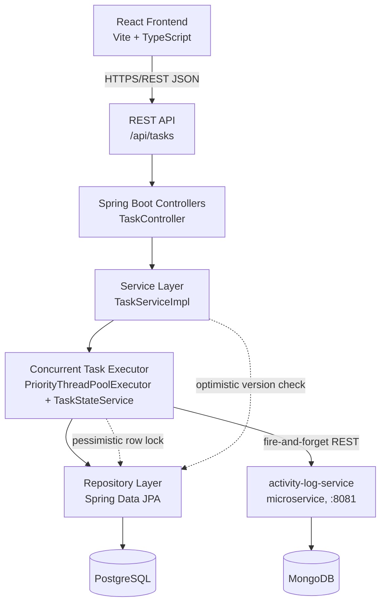

# Task Execution Console

A full-stack platform for creating, running, and monitoring asynchronous tasks with **real concurrent execution** on the backend. Built as a demonstration of production-oriented Java concurrency, clean layered Spring Boot architecture, and a React operations dashboard.

```
React (TS)  →  REST API  →  Spring Boot Controllers  →  Service Layer  →  Concurrent Task Executor  →  Repository  →  PostgreSQL
                                                                                 ↓
                                                                  activity-log-service (microservice) → MongoDB
```

---

## 1. Project overview

Users create tasks (name, type, priority, optional simulated duration), then execute them. Execution happens on a dedicated, configurable Java thread pool — multiple tasks run **at the same time**, on separate worker threads, with their lifecycle (`PENDING → RUNNING → COMPLETED/FAILED/CANCELLED`) persisted safely under concurrent access. The React dashboard polls the API every two seconds so you can watch tasks move through the pipeline, and it visualizes the live worker pool (active threads vs. capacity) as tasks run.

Key things this project is meant to demonstrate:

- A managed, bounded, **priority-aware** thread pool — no ad hoc thread creation.
- Safe concurrent state transitions using pessimistic row locks + optimistic version checks, so a cancel request and a finishing worker thread can never corrupt a task's status.
- A thin-controller / fat-service layered backend with DTOs, centralized exception handling, and Flyway-managed schema.
- Concurrency-focused tests that actually exercise multiple real threads rather than only asserting on mocks.
- A fully containerized deployment (`docker compose up --build`), split across two backend microservices.
- A second microservice (`activity-log-service`) backed by MongoDB for schemaless task-event data, called fire-and-forget from the main service so it never affects task execution.

## 2. Architecture



Request flow for "execute a task":

1. `TaskController` validates the path variable and delegates to `TaskServiceImpl`.
2. `TaskServiceImpl` checks the task is `PENDING`, then hands off to `TaskExecutionService.submit(...)`.
3. `TaskExecutionService` wraps the work as a `PrioritizedRunnable` (carrying the task's `TaskPriority`) and submits it to the shared `taskExecutionPool` bean, tracking the returned `Future` (for cancellation).
4. The worker thread calls `TaskStateService.markRunning(...)`, which locks the row (`SELECT ... FOR UPDATE`), flips status to `RUNNING`, and commits in its own short transaction.
5. The worker "does the work" (simulated), then calls `markCompleted(...)` or `markFailed(...)` — again under a row lock, and only if the task hasn't already been cancelled out from under it.
6. Each of these transitions also calls `ActivityLogClient.record(...)`, which POSTs a lifecycle event (`STARTED`/`COMPLETED`/`FAILED`/`CANCELLED`) to the standalone `activity-log-service`, which persists it as a schemaless document in MongoDB. This call is best-effort — any failure is logged and swallowed, never propagated back into the task's own transaction.
7. The React dashboard's poller picks up the new state on its next `GET /api/tasks` / `GET /api/tasks/stats` call.

### Microservices

| Service | Port | Datastore | Responsibility |
|---|---|---|---|
| `backend` (task-execution-platform) | 8080 | PostgreSQL | Task CRUD, concurrent execution, lifecycle state machine |
| `activity-log-service` | 8081 | MongoDB | Records task lifecycle events (`POST /api/events`, `GET /api/events/task/{id}`) as flexible, schemaless documents |

The two are independently deployable Spring Boot apps (separate `pom.xml`/`Dockerfile` each), talking over REST — `backend` never touches MongoDB directly, and `activity-log-service` never touches Postgres.

## 3. Technology stack

| Layer | Technologies |
|---|---|
| Frontend | React 18, TypeScript, Vite, React Router, Axios |
| Backend (task service) | Java 17, Spring Boot 3, Spring Web, Spring Data JPA, Hibernate, Bean Validation, Flyway |
| Backend (activity-log microservice) | Java 17, Spring Boot 3, Spring Web, Spring Data MongoDB |
| Databases | PostgreSQL 16 (tasks), MongoDB 7 (task events) |
| Testing | JUnit 5, Mockito, AssertJ, Testcontainers |
| Infra | Docker, Docker Compose, nginx (serving the built frontend), AWS EC2 (deploy script) |

## 4. Project structure

```
task-platform/
├── backend/
│   ├── src/main/java/com/taskmanager/
│   │   ├── controller/      TaskController
│   │   ├── service/         TaskService, TaskServiceImpl
│   │   ├── executor/        TaskExecutionService, TaskStateService, PriorityThreadPoolExecutor (the concurrency core)
│   │   ├── repository/      TaskRepository
│   │   ├── entity/          Task, TaskStatus, TaskPriority
│   │   ├── dto/              TaskCreateRequest, TaskResponse, TaskStatsResponse, ErrorResponse
│   │   ├── mapper/          TaskMapper
│   │   ├── exception/       Custom exceptions + GlobalExceptionHandler
│   │   └── config/          ThreadPoolConfig, TaskExecutorProperties, CorsConfig
│   ├── src/main/resources/
│   │   ├── application.yml
│   │   └── db/migration/V1__create_tasks_table.sql
│   ├── src/test/java/...    Controller, service, executor, and integration tests
│   ├── Dockerfile
│   └── pom.xml
├── backend/activity-log-service/      Second microservice (own pom.xml, own Dockerfile)
│   ├── src/main/java/com/taskmanager/activitylog/
│   │   ├── controller/      TaskEventController
│   │   ├── model/           TaskEvent (Mongo document)
│   │   ├── repository/      TaskEventRepository
│   │   └── dto/             TaskEventRequest
│   ├── src/main/resources/application.yml
│   ├── Dockerfile
│   └── pom.xml
├── frontend/
│   ├── src/
│   │   ├── api/taskApi.ts        API service layer (all HTTP calls live here)
│   │   ├── components/           Header, StatsCards, TaskForm, TaskTable, badges, modals, etc.
│   │   ├── pages/Dashboard.tsx   Orchestrates state, polling, and actions
│   │   ├── types/task.ts
│   │   └── styles/theme.css
│   ├── Dockerfile
│   ├── nginx.conf
│   └── package.json
├── docker-compose.yml
├── .env.example
├── deploy/aws-ec2-deploy.sh   rsync + docker compose up on an EC2 box you provision
└── README.md
```

## 5. Database schema

Table `tasks` (see `backend/src/main/resources/db/migration/V1__create_tasks_table.sql`):

| Column | Type | Notes |
|---|---|---|
| id | BIGSERIAL PK | |
| name | VARCHAR(150) | required |
| description | VARCHAR(2000) | optional |
| task_type | VARCHAR(50) | required; `FAIL_TEST` deterministically fails, for demos/tests |
| priority | VARCHAR(20) | `LOW` / `MEDIUM` / `HIGH` / `CRITICAL` |
| status | VARCHAR(20) | `PENDING` / `RUNNING` / `COMPLETED` / `FAILED` / `CANCELLED` |
| input_duration_seconds | INTEGER | optional simulated workload length |
| input_data | VARCHAR(4000) | optional free-form payload |
| created_at / started_at / completed_at | TIMESTAMPTZ | lifecycle timestamps |
| execution_duration_ms | BIGINT | wall-clock duration once finished |
| error_message | VARCHAR(2000) | populated on failure |
| retry_count | INTEGER | incremented on each retry |
| version | BIGINT | JPA `@Version` — optimistic locking |

Indexes on `status`, `priority`, and `created_at` support the dashboard's filtering and sort order.

## 6. REST API documentation

Base path: `/api/tasks`

| Method | Path | Description | Success | Notable errors |
|---|---|---|---|---|
| POST | `/api/tasks` | Create a task (starts `PENDING`) | 201 | 400 validation |
| GET | `/api/tasks?status=&priority=` | List tasks, optional filters | 200 | — |
| GET | `/api/tasks/stats` | Aggregate counts + live worker pool utilization | 200 | — |
| GET | `/api/tasks/{id}` | Get one task | 200 | 404 |
| POST | `/api/tasks/{id}/execute` | Submit a `PENDING` task to the executor | 202 | 404, 409 (wrong state), 503 (pool saturated) |
| POST | `/api/tasks/{id}/cancel` | Cancel a `PENDING`/`RUNNING` task | 200 | 404, 409 (already terminal) |
| POST | `/api/tasks/{id}/retry` | Reset a `FAILED` task to `PENDING` and resubmit | 202 | 404, 409 (not `FAILED`) |
| DELETE | `/api/tasks/{id}` | Delete a task (not while `RUNNING`) | 204 | 404, 409 |

All errors share one JSON shape (`GlobalExceptionHandler`):

```json
{
  "timestamp": "2026-07-27T10:15:00Z",
  "status": 409,
  "error": "Conflict",
  "message": "Task 4 cannot be cancelled - already COMPLETED",
  "path": "/api/tasks/4/cancel"
}
```

## 7. Concurrent execution design

- **Single managed pool.** `ThreadPoolConfig` defines the one and only executor bean (`taskExecutionPool`), a `PriorityThreadPoolExecutor` (`backend/src/main/java/com/taskmanager/executor/PriorityThreadPoolExecutor.java`). Core size, max size, queue capacity, keep-alive, and thread name prefix are all environment-configurable (see `task.executor.*` in `application.yml`, driven by `TASK_EXECUTOR_*` env vars). Controllers never spawn threads; they call into `TaskExecutionService`.
- **Priority-based scheduling.** The pool's queue is a capacity-bounded `PriorityBlockingQueue` instead of a plain FIFO queue. Each submitted task is wrapped in a `Comparable` future carrying its `TaskPriority` (`LOW`/`MEDIUM`/`HIGH`/`CRITICAL`) and a monotonic submission sequence number. When a worker frees up, it always dequeues the highest-priority waiting task; ties (same priority) are broken FIFO by submission order. Note this only affects tasks that actually have to wait — if a worker is idle at submission time, `ThreadPoolExecutor` hands it the new task directly rather than queuing it, so priority only matters once the pool is saturated. There's no aging/starvation prevention: under sustained high-priority load, a `LOW` task can wait indefinitely.
- **Backpressure, not silent drops.** The rejection policy is a custom handler that throws `TaskQueueFullException`, surfaced to the API as `503 Service Unavailable`, instead of Java's default `CallerRunsPolicy` (which would block the HTTP thread) or `DiscardPolicy` (which would silently lose work).
- **Cancellation.** `TaskExecutionService` keeps a `ConcurrentHashMap<Long, Future<?>>` of in-flight work. `cancel()` calls `Future#cancel(true)` to interrupt the worker mid-`sleep`/mid-work, then unconditionally calls `TaskStateService.markCancelled(...)`, which re-checks the task's current DB state under a row lock — so cancelling a task that has *just* finished is safely rejected with a 409 rather than corrupting a `COMPLETED` task into `CANCELLED`.
- **Safe state transitions.** Every transition (`markRunning`, `markCompleted`, `markFailed`, `markCancelled`, `resetForRetry`) lives in `TaskStateService`, each in its own `REQUIRES_NEW` transaction guarded by `SELECT ... FOR UPDATE` (`TaskRepository.findByIdForUpdate`). A worker thread finishing a task and a user's cancel request racing each other resolve deterministically: whichever acquires the row lock first wins, and the loser's transition is a no-op guarded by an explicit status check (e.g. `markCompleted` skips itself if the row is no longer `RUNNING`).
- **Optimistic locking as a second line of defense.** The `Task.version` column (`@Version`) means any stray concurrent write outside the lock-guarded paths fails fast with `OptimisticLockException`, translated to `409 Conflict` by `GlobalExceptionHandler`.
- **Failure isolation.** An exception inside one worker's task body is caught inside `TaskExecutionService.runTask`, recorded via `markFailed`, and never escapes to crash the pool or affect other in-flight tasks.

## 8. Local development (without Docker)

**Activity-log microservice** (start this first — the task service calls it on every state transition, though it degrades gracefully if it's down)

```bash
cd backend/activity-log-service
# requires a running MongoDB (or `docker compose up mongo` from the repo root)
export MONGODB_URI=mongodb://localhost:27017/activity_log
mvn spring-boot:run
```

Now on `http://localhost:8081/api/events`.

**Backend (task service)**

```bash
cd backend
# requires a running PostgreSQL matching the env vars below (or use `docker compose up postgres` from the repo root)
export DB_HOST=localhost DB_PORT=5432 DB_NAME=taskdb DB_USERNAME=taskuser DB_PASSWORD=taskpass
export ACTIVITY_LOG_BASE_URL=http://localhost:8081
mvn spring-boot:run
```

The API is now on `http://localhost:8080/api/tasks`. Flyway applies migrations automatically on startup.

**Frontend**

```bash
cd frontend
cp .env.example .env   # defaults are fine for local dev
npm install
npm run dev
```

Vite's dev server proxies `/api/*` to `http://localhost:8080`, so the frontend at `http://localhost:5173` talks to your locally-running backend without CORS trouble.

## 9. Docker setup

```bash
cp .env.example .env   # optional - defaults work out of the box
docker compose up --build
```

This starts five containers on one bridge network:

- `postgres` — PostgreSQL 16 with a persistent named volume (`postgres_data`) and a health check.
- `mongo` — MongoDB 7 with a persistent named volume (`mongo_data`) and a health check.
- `activity-log-service` — Spring Boot microservice, waits for Mongo to be healthy, exposes `:8081`.
- `backend` — Spring Boot, waits for Postgres and `activity-log-service` to be healthy, runs Flyway migrations on boot, exposes `:8080`.
- `frontend` — nginx serving the built React app on `:80`, proxying `/api/*` to the backend container.

Open `http://localhost:80` once all containers report healthy (`docker compose ps`).

No credentials are hardcoded in source: the database name/user/password, CORS origins, thread pool sizing, and the activity-log URL all come from environment variables (see `.env.example`).

## 9a. Public deployment

_Instance is currently **stopped**. When it's running, list the live URL(s) here — e.g._

- Frontend: `http://<ec2-public-ip-or-dns>`
- Backend API: `http://<ec2-public-ip-or-dns>:8080/api/tasks`

Note: unless an Elastic IP is attached, stopping/starting the EC2 instance assigns a new public IP, so this will need updating after every restart.

## 9b. Deploying to AWS

`deploy/aws-ec2-deploy.sh` rsyncs this repo to an EC2 instance you provision and runs `docker compose up --build -d` there — the cheapest legitimate way to run the whole stack on AWS without standing up ECS/EKS.

One-time setup you do yourself (needs your AWS account, not something run from this repo):

1. Launch an EC2 instance (Amazon Linux 2023, `t3.small` or larger) with Docker + the Docker Compose plugin installed.
2. Open inbound ports 22 (SSH), 80 (frontend), 8080 (backend API), 8081 (activity-log API, optional) in its security group.
3. Have the SSH key pair for that instance on hand.

Then, from the repo root:

```bash
./deploy/aws-ec2-deploy.sh ec2-user@<public-ip-or-dns> /path/to/key.pem
```

This copies the repo (minus `node_modules`/`target`/`.git`) to the instance and runs `docker compose up --build -d` remotely. Re-run it any time you want to redeploy changes.

## 10. Testing instructions

```bash
cd backend
mvn test                 # unit + Mockito tests (controller, service, executor concurrency/failure/cancellation)
mvn verify                # also runs the Testcontainers-backed repository integration test (needs Docker)
```

What's covered:

- **Controller tests** (`TaskControllerTest`, `@WebMvcTest`) — request validation, status codes, and the centralized error shape, with the service layer mocked.
- **Service unit tests** (`TaskServiceImplTest`, Mockito) — state-transition guards (can't execute a `RUNNING` task, can't delete a `RUNNING` task, retry only from `FAILED`), 404 handling.
- **Concurrent execution tests** (`TaskExecutionServiceTest`) — run against a *real* `PriorityThreadPoolExecutor`, using `CountDownLatch`es to prove multiple tasks are genuinely running on distinct threads at the same time (not queued one-after-another), and that queued higher-priority tasks are dequeued ahead of lower-priority ones once workers saturate.
- **Failure handling tests** — a task type of `FAIL_TEST` deterministically throws inside the worker; asserts it's reported `FAILED` (never `COMPLETED`) and that the pool keeps accepting new work afterward.
- **Cancellation tests** — asserts `Future#cancel(true)` actually interrupts a sleeping worker and the task ends up `CANCELLED`, never `COMPLETED`.
- **Repository/integration tests** (`TaskRepositoryIntegrationTest`, Testcontainers + real PostgreSQL) — verifies the Flyway migration, JPA mappings, filtering queries, and that the `version` column increments on update.

> Both backend modules (`backend` and `backend/activity-log-service`) have been verified to compile cleanly with `mvn compile`. `mvn test`/`docker compose up --build` have **not** been run in this environment — run them yourself before treating this as verified.
>
> **Known local-machine issue:** if you're on JDK 25 (very new as of writing), Lombok's annotation processor bundled with Spring Boot 3.2.5 fails silently — you'll see errors like `cannot find symbol: method getStatus()` on `Task`, even though nothing is wrong with the code. This is a JDK/Lombok compatibility issue, not a bug in this project. Fix: build/run with JDK 17–21 (e.g. `JAVA_HOME=$(/usr/libexec/java_home -v 21) mvn compile`), or bump the Lombok version in `backend/pom.xml` if you're set on JDK 25.

## 11. Example API requests

Create a task:

```bash
curl -X POST http://localhost:8080/api/tasks \
  -H "Content-Type: application/json" \
  -d '{
        "name": "Nightly report",
        "description": "Aggregate yesterday'"'"'s orders",
        "type": "REPORT",
        "priority": "HIGH",
        "durationSeconds": 8
      }'
```

Execute it (assume it came back with `"id": 1`):

```bash
curl -X POST http://localhost:8080/api/tasks/1/execute
```

Watch it live:

```bash
watch -n1 'curl -s http://localhost:8080/api/tasks/1 | jq'
```

Cancel a running task:

```bash
curl -X POST http://localhost:8080/api/tasks/1/cancel
```

Retry a failed task:

```bash
curl -X POST http://localhost:8080/api/tasks/1/retry
```

Filter the list:

```bash
curl "http://localhost:8080/api/tasks?status=RUNNING&priority=HIGH"
```

Fire several tasks at once to see concurrency in action:

```bash
for i in 1 2 3 4 5; do
  id=$(curl -s -X POST http://localhost:8080/api/tasks \
    -H "Content-Type: application/json" \
    -d "{\"name\":\"Job $i\",\"type\":\"DATA_SYNC\",\"priority\":\"MEDIUM\",\"durationSeconds\":10}" | jq -r .id)
  curl -s -X POST http://localhost:8080/api/tasks/$id/execute > /dev/null
done
curl -s http://localhost:8080/api/tasks/stats | jq
```

With the default pool (`core=4`, `max=10`), the `stats` response's `activeWorkerThreads` should show several tasks running at once, and the dashboard's worker-pool strip will light up multiple slots simultaneously.

## 12. Screenshots

_Add screenshots here once you've run the app locally — e.g. the dashboard with several tasks `RUNNING` concurrently, the worker-pool strip lit up, and the task detail modal for a `FAILED` task._

| View | Screenshot |
|---|---|
| Dashboard overview | _(add image)_ |
| Concurrent execution in progress | _(add image)_ |
| Task detail modal | _(add image)_ |
| Create task form | _(add image)_ |

---

## Notes on what to verify before treating this as production-ready

`mvn compile` has been verified for both backend modules (see the JDK note in section 10). The following have **not** been run in this environment and should be verified by you:

1. Run `mvn clean verify` in `backend/` and `backend/activity-log-service/` and fix any dependency-version mismatches.
2. Run `npm install && npm run build` in `frontend/`.
3. Run `docker compose up --build` from the repo root and confirm all five health checks go green.
4. Fire the concurrent-load example in section 11 and confirm the worker-pool visualization reflects real parallelism, and that `GET http://localhost:8081/api/events/task/{id}` shows the recorded lifecycle events for a task you ran.
